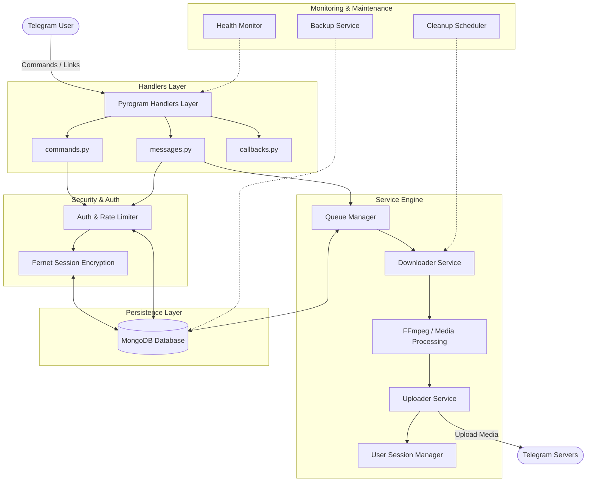

<div align="center">

# 🚀 Telegram Save Restricted Content Bot

[](https://www.python.org/)
[](https://docs.pyrogram.org/)
[](https://www.mongodb.com/)
[](https://www.docker.com/)
[](https://opensource.org/licenses/MIT)
[](#)

<p align="center">
  <b>A modern, high-performance, and modular Telegram bot designed to download restricted & private content with persistent queue management, encrypted sessions, dynamic animated progress tracking, and enterprise-grade reliability.</b>
</p>

[✨ Features](#-key-features) •
[🏛 Architecture](#-system-architecture) •
[🚀 Quick Start](#-quick-start-guide) •
[🐳 Docker Setup](#-docker-deployment) •
[⚙️ Configuration](#️-configuration-guide-env) •
[📖 Commands](#-commands-reference) •
[💡 Usage Guide](#-usage-walkthrough)

---

</div>

## 🌟 Key Features

### 🔓 Restricted & Private Content Downloading
- **Private Channels & Groups**: Seamlessly fetch media and messages from private or restricted entities after logging in.
- **Single & Batch Downloads**: Download individual posts or massive batches using clean range syntax (e.g. `https://t.me/c/1234567890/10-50`).
- **Bot & Topic Messages**: Support for bot links (`https://t.me/b/botname/123`), private join links (`https://t.me/+...`), and supergroup forum topics.
- **Media Transcoding & Thumbnail Generation**: Automatic FFmpeg video thumbnail extraction and duration detection.

### ⏸️ Persistent Queue Engine & Crash Resilience
- **MongoDB Queue Persistence**: Every queue state is written to the database; if the bot restarts, active tasks automatically resume where they left off.
- **Dynamic Queue Controls**: Pause, resume, cancel, or skip queued tasks directly via inline keyboard buttons in real time.
- **Queue Inspector**: View upcoming items in the queue with a single click.

### 🔐 Enterprise-Grade Security
- **Fernet Session Encryption**: User sessions (string sessions) are encrypted at rest using AES-128-CBC / Fernet (`cryptography`).
- **Per-User Isolation**: Each user’s session is sandboxed and isolated; no cross-user session leakage.
- **Built-in Rate Limiting**: Token-bucket rate limiting prevents flood bans and Telegram API abuse.
- **Admin Access Control**: Sensitive commands (`/stats`, `/broadcast`, `/backup`, `/restart`, `/logs`) are strictly protected.

### 🎨 Rich Animated Progress UI
- **6 Progress Bar Styles**: Choose from `modern`, `gradient`, `block`, `circle`, `square`, and `arrow`.
- **Real-Time Transfer Telemetry**: Live updates showing percentage, transferred size, total size, instantaneous speed, ETA, and elapsed time.
- **Interactive Inline Buttons**: Action buttons to Pause, Resume, Stop, Refresh, or view Task Details.

### ⚙️ Deep Customization & Preferences
- **Custom Captions**: Set custom captions with dynamic template placeholders (`{filename}`, `{size}`, `{duration}`, `{caption}`).
- **Custom Thumbnails**: Upload custom cover thumbnails for uploaded videos and documents.
- **Target Chat Forwarding**: Route downloaded media to your own custom channel, group, or saved messages.
- **Granular File Filters**: Filter out unwanted file types (`video`, `document`, `audio`, `photo`, `animation`, `sticker`, `voice`).

### 📊 Monitoring, Backups & Maintenance
- **System Resource Metrics**: Real-time CPU, RAM, disk usage, and network transfer statistics.
- **Automated Cleanup Scheduler**: Periodic removal of expired temp files, orphaned downloads, and empty directories.
- **Automated MongoDB Backups**: Automated database dumps and compressed backup rotations.
- **Health Monitoring & Auto-Restart**: Watchdog service monitors bot health and alerts admins if an issue occurs.

---

## 🏛 System Architecture



---

## 📁 Project Structure

```bash
Save-Restricted-Content/
├── database/                   # MongoDB database connection & query models
│   ├── __init__.py
│   └── mongodb.py              # User, session, queue, settings & metric storage
│
├── plugins/                    # Core bot plugins & service modules
│   ├── core/                   # Shared models, constants, and utilities
│   │   ├── animations.py       # Progress spinners, wave animations, and bars
│   │   ├── constants.py        # Enums, MIME mappings, status types, emojis
│   │   ├── models.py           # Dataclasses (FileTask, QueueState, LinkInfo)
│   │   └── utils.py            # Formatting, rate limiters, file helpers, logger
│   │
│   ├── handlers/               # Pyrogram event handlers
│   │   ├── callbacks.py        # Inline button queries (settings, queue controls)
│   │   ├── commands.py         # User & Admin command handlers (/start, /login)
│   │   └── messages.py         # Link parser, media receiver & batch processor
│   │
│   ├── monitoring/             # System health, metrics & automated cleanup
│   │   ├── cleanup.py          # Scheduled disk cleanup & temp file purge
│   │   ├── health.py           # System resource watchdog & health alerts
│   │   └── metrics.py          # Transfer speeds, download counters, error tracking
│   │
│   ├── security/               # Authentication & session encryption
│   │   ├── auth.py             # User authorization & rate-limiting guards
│   │   └── encryption.py       # AES / Fernet session encryption helpers
│   │
│   ├── services/               # Core background business logic
│   │   ├── downloader.py       # Pyrogram media download pipeline
│   │   ├── queue_manager.py    # Multi-user persistent queue engine
│   │   ├── session_manager.py  # User Pyrogram Client session lifecycle
│   │   └── uploader.py         # Media upload pipeline with custom metadata
│   │
│   └── progress_display.py     # Live progress rendering & inline control markup
│
├── .env.sample                 # Environment configuration template
├── bot.py                      # Bot entry point & lifecycle manager
├── config.py                   # Environment variable loader & validator
├── Dockerfile                  # Production container image definition
├── docker-compose.yml          # Container stack with MongoDB & volume mounts
├── requirements.txt            # Python dependencies (Pyrogram, Motor, etc.)
├── saverestricted.service      # Linux Systemd unit file template
└── saverestricted.sh           # Autonomous startup & environment bootstrap script
```

---

## 🛠️ Prerequisites

Ensure you have the following installed on your host system:

- **Python**: `3.9` or higher
- **MongoDB**: `4.4` or higher (local or MongoDB Atlas)
- **FFmpeg**: Required for media processing and video thumbnail generation
  - Ubuntu/Debian: `sudo apt install ffmpeg`
  - Arch Linux: `sudo pacman -S ffmpeg`
  - Fedora: `sudo dnf install ffmpeg`
- **Telegram API Credentials**:
  - `API_ID` & `API_HASH` from [my.telegram.org](https://my.telegram.org/apps)
  - `BOT_TOKEN` from [@BotFather](https://t.me/BotFather)
- **Encryption Key**: A 32-byte Fernet base64 key:
  ```bash
  python3 -c "from cryptography.fernet import Fernet; print(Fernet.generate_key().decode())"
  ```

---

## 🚀 Quick Start Guide

### Option 1: Native Setup (Virtual Environment)

1. **Clone the repository:**
   ```bash
   git clone https://github.com/IceCube9680/Save-Restricted-Content.git
   cd Save-Restricted-Content
   ```

2. **Create and activate a virtual environment:**
   ```bash
   python3 -m venv venv
   source venv/bin/activate
   ```

3. **Install dependencies:**
   ```bash
   pip install --upgrade pip
   pip install -r requirements.txt
   ```

4. **Configure your environment:**
   ```bash
   cp .env.sample .env
   nano .env
   ```
   *Fill in `API_ID`, `API_HASH`, `BOT_TOKEN`, `MONGODB_URI`, `ADMINS`, and `ENCRYPTION_KEY`.*

5. **Start the bot:**
   ```bash
   python3 bot.py
   ```
   *Or use the all-in-one launcher script:*
   ```bash
   chmod +x saverestricted.sh
   ./saverestricted.sh
   ```

---

## 🐳 Docker Deployment

Run the bot and MongoDB simultaneously using Docker Compose:

1. **Clone the repository and prepare `.env`:**
   ```bash
   git clone https://github.com/IceCube9680/Save-Restricted-Content.git
   cd Save-Restricted-Content
   cp .env.sample .env
   nano .env
   ```

2. **Launch with Docker Compose:**
   ```bash
   docker-compose up -d --build
   ```

3. **Check container logs:**
   ```bash
   docker-compose logs -f bot
   ```

4. **Stop the containers:**
   ```bash
   docker-compose down
   ```

---

## 🐧 Linux Systemd Service Setup

To run the bot as a background daemon with auto-restart on boot:

1. **Copy the service file:**
   ```bash
   sudo cp saverestricted.service /etc/systemd/system/saverestricted.service
   ```

2. **Edit paths and user:**
   ```bash
   sudo nano /etc/systemd/system/saverestricted.service
   ```
   *Ensure `User`, `WorkingDirectory`, and `ExecStart` match your server paths.*

3. **Reload daemon and enable service:**
   ```bash
   sudo systemctl daemon-reload
   sudo systemctl enable saverestricted
   sudo systemctl start saverestricted
   ```

4. **Inspect status and live logs:**
   ```bash
   sudo systemctl status saverestricted
   sudo journalctl -u saverestricted -f
   ```

---

## ⚙️ Configuration Guide (`.env`)

| Variable | Type | Default | Description |
| :--- | :--- | :--- | :--- |
| **`API_ID`** | `int` | *Required* | Telegram API ID from [my.telegram.org](https://my.telegram.org) |
| **`API_HASH`** | `str` | *Required* | Telegram API Hash from [my.telegram.org](https://my.telegram.org) |
| **`BOT_TOKEN`** | `str` | *Required* | Telegram Bot Token from [@BotFather](https://t.me/BotFather) |
| **`MONGODB_URI`** | `str` | `mongodb://localhost:27017` | MongoDB connection URI string |
| **`MONGODB_DB_NAME`** | `str` | `save_restricted_bot` | Database name to use in MongoDB |
| **`ADMINS`** | `list` | `[]` | Comma-separated list of admin Telegram User IDs |
| **`LOG_CHANNEL`** | `int` | `None` | Telegram Channel ID for logging bot events & errors |
| **`LOGIN_SYSTEM`** | `bool` | `True` | Enables multi-user OTP login for restricted content |
| **`ENCRYPTION_KEY`** | `str` | *Required if Login Enabled* | 32-byte Fernet key for encrypting user session data |
| **`STRING_SESSION`** | `str` | `None` | Global Pyrogram session string (if `LOGIN_SYSTEM=False`) |
| **`WAITING_TIME`** | `int` | `2` | Interval delay (in seconds) between batch downloads |
| **`MAX_FILE_SIZE`** | `int` | `2000` | Maximum file size permitted for download (in MB) |
| **`MAX_BATCH_SIZE`** | `int` | `1000000000000` | Maximum number of messages in a single batch range |
| **`RATE_LIMIT_ENABLED`** | `bool` | `True` | Enables rate limiting to prevent spam and flood |
| **`RATE_LIMIT_REQUESTS`** | `int` | `10` | Maximum requests allowed per rate limit window |
| **`RATE_LIMIT_WINDOW`** | `int` | `60` | Duration of the rate limit window (in seconds) |
| **`DEFAULT_PROGRESS_STYLE`**| `str` | `modern` | Progress bar visual style (`modern`, `gradient`, `block`, `circle`, `square`, `arrow`) |
| **`ENABLE_WAVE_ANIMATION`** | `bool` | `True` | Displays dynamic wave animations in progress messages |
| **`CLEANUP_INTERVAL`** | `int` | `3600` | Automated disk cleanup interval (in seconds) |
| **`BACKUP_ENABLED`** | `bool` | `True` | Enables automated MongoDB database backups |
| **`WORKERS`** | `int` | `20` | Number of concurrent Pyrogram worker threads |
| **`MAX_CONCURRENT_TRANSMISSIONS`** | `int` | `10` | Concurrent Pyrogram parallel DC transfer connections |

---

## 📖 Commands Reference

### 👤 User Commands

| Command | Arguments | Description |
| :--- | :--- | :--- |
| `/start` | None | Initialize interaction with the bot, view main menu and quick-access buttons. |
| `/help` | None | Display usage guide, supported link formats, and troubleshooting tips. |
| `/login` | None | Authenticate with your Telegram phone number & OTP (required for restricted private content). |
| `/logout` | None | Revoke active session, erase encrypted session data, and log out. |
| `/settings` | None | Open interactive settings panel (custom thumbnail, custom caption, target chat, file filters, progress style). |
| `/cancel` | None | Instantly abort current download batch and release worker resources. |
| `/status` | None | Check overall bot availability and server health status. |

### 👑 Admin Commands

| Command | Arguments | Description |
| :--- | :--- | :--- |
| `/stats` | None | View detailed real-time telemetry (CPU %, RAM %, Disk usage, active users, DB stats, download counts). |
| `/users` | None | Display total registered users, active user count, and recent user activity. |
| `/broadcast` | `[reply / text]` | Broadcast a message or forwarded media to all registered bot users with real-time success/fail counter. |
| `/backup` | None | Generate an on-demand compressed MongoDB database backup and send it to the admin. |
| `/logs` | None | Retrieve and send the latest bot execution log file. |
| `/restart` | None | Perform a graceful bot process restart and resume pending queues. |

---

## 💡 Usage Walkthrough

### 1. Downloading Public Telegram Posts
Simply copy any public channel message link and send it to the bot:
```text
https://t.me/channel_username/1234
```

### 2. Accessing Private Channels & Restricted Content
1. Send `/login` to the bot.
2. Enter your phone number in international format (e.g. `+12345678900`).
3. Enter the Telegram OTP verification code received.
4. If Two-Step Verification (2FA) is enabled, enter your password.
5. Once logged in, send any private post link:
   ```text
   https://t.me/c/1234567890/100
   ```

### 3. Batch Downloading Message Ranges
To download multiple consecutive messages, use the range delimiter (`-`):
```text
https://t.me/c/1234567890/100-150
```
- The bot adds the tasks to a persistent queue.
- You can monitor progress with interactive controls (**Pause**, **Resume**, **Cancel**, **Skip**, **Details**, **Queue List**).

### 4. Customizing Captions & Placeholders
In `/settings` ➔ **Custom Caption**, you can use dynamic tags:
- `{filename}` – Original file name
- `{size}` – Human-readable file size (e.g. `45.20 MB`)
- `{duration}` – Media playback duration (e.g. `02:15:30`)
- `{caption}` – Original message caption (if any)

*Example template:*
```text
🎬 {filename}
💾 Size: {size} | ⏱️ Duration: {duration}

Uploaded via @YourBotUsername
```

---

## 🛡 Security & Best Practices

- **Never Commit `.env`**: Keep your `.env` file private and never publish your `BOT_TOKEN`, `API_HASH`, or `ENCRYPTION_KEY`.
- **Session Encryption**: Ensure `ENCRYPTION_KEY` is securely generated and never changed while user sessions are active, as it will invalidate existing session keys.
- **Telegram Rate Limits**: Avoid setting `WAITING_TIME` below `2` seconds during high-volume batch downloads to prevent Telegram FloodWait penalties.
- **Database Backups**: Always keep automated backups enabled (`BACKUP_ENABLED=True`) to safeguard user configurations and queue states.

---

## 🤝 Community & Support

Need assistance, found a bug, or want to suggest a feature?

- **💬 Support Group**: [MovieVerse Discussion](https://t.me/movieverse_discussion_2)
- **📢 Updates Channel**: [Ice Verse Updates](https://t.me/ice_verse)
- **👨‍💻 Developer Portfolio**: [Visit Developer](https://icecube9680.github.io)

---

## 📜 License

This project is distributed under the **MIT License**. See the [LICENSE](file:///home/icecube/ASUS/Save-Restricted-Content/LICENSE) file for more information.

---

## ⚠️ Legal Disclaimer

> **DISCLAIMER**: This tool is provided for **educational and personal archival purposes only**. Downloading copyrighted or restricted materials without explicit authorization may violate Telegram's Terms of Service and local copyright laws. The developers of this software assume no liability or responsibility for any misuse or damages resulting from the use of this project.

<div align="center">
  <sub>Built with ❤️ for speed, reliability, and scale.</sub>
</div>
